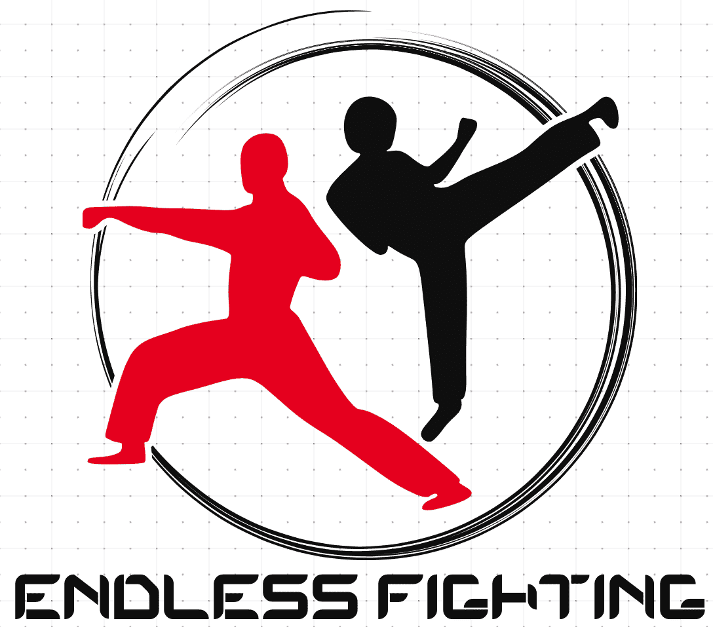

# Endless_Fighting

### Binôme
- Deloison Lucas
- Leclercq Victor

## _Table des matières_
1. [Objectifs](#1)
    * [Description générale](#1.1)
    * [Contexte](#1.2)
2. [Expression du besoin](#2)
    * [Règles du jeu](#2.1)
    * [L'interface utilisateur](#2.2)       
        - [Visuel](#2.2.1)
        - [Interaction](#2.2.2)
    * [Manuel utilisateur](#2.3)
    * [Contraintes techniques](#2.4)
    * [Scénario d'utilisation](#2.5)
        - [Scénario principal](#2.5.1)
        - [Jouer une manche](#2.5.2)
3. [Analyse du besoin](#3)
    * [Fonctionnalités](#3.1)
4.  [Livrables](#4)
    * [Echéancier](#4.1)
    
#### 1. Objectifs
##### _1.1. Description générale_
  Pour ce projet, nous souhaitons réaliser un jeu nommé « Endless Fighting » reprenant l'idée des jeux traditionnelles sur les combats de personnages en stick. Autrement dit, le jeu illustre un bonhomme en stick se battant pour acquérir le plus de points possibles.

##### _1.2. Contexte_
  Le projet Endless Fighting est un projet réalisé dans l'UE "Mise en oeuvre des langages de programmation". Le but est de s'exercer et d'apprendre la programmation orientée objet dans le langage Python. En utilisant, lorsque nécessaire, les arbres balancés ainsi que différents algorithmes utilisé pendant ce projet.

#### 2. Expression du besoin
  « Endless Fighting » est un jeu de combat pour un joueur. L'utilisateur peut se mesurer à la machine qui incarnera les divers adversaires de la partie. Le principe du jeu est de proposer à l'utilisateur une partie "infinie". Chaque partie donne un score final au joueur, qui est déterminé par le nombre d'ennemis vaincus.

##### _2.1. Règles du jeu_
  Nous nous appuyons sur quelques règles:
  - Il s'agit d'éliminer les différents adversaires qui apparaissent sur l'écran. 
  - Il y a deux entitées : l'utilisateur (joueur principal) et l'ordinateur (adversaires).
  - Le jeu débute avec le personnage sur un terrain aléatoirement généré.
  - Le joueur peut choisir sa difficulté, ses compétences et son apparence.
  - Un joueur gagne des points lorsqu'il élimine des adversaires.
  - En éliminant plusieurs adversaires sans se faire toucher, il génère un combo, qui multiplie les points gagnés.
  - Si la vie du joueur tombe à 0, ses points sont enregistrés dans un leaderboard.

##### _2.2. L'interface utilisateur_

###### 2.2.1. Visuel
  - Pendant la partie, le joueur est sur un terrain en 2D, il peut apercevoir son score, ses compétences et sa barre de combo.
  - Visuel : (TODO - [Image du jeu])

###### 2.2.2. Interaction
  L'utilisateur interagit uniquement avec le clavier :
  - Les touches « **z** », « **q** », « **s** », « **d** » permettent de déplacer le personnage.
  - Les touches « **a** », « **e** » permettent de lancer des compétences.
  - La touche « **space** » est l'action spammable.

##### _2.3. Manuel utilisateur_
  - Lancer le jeu : (TODO - [Commande lorsque le jeu sera développé])
  - Accueil : Jouer, Personnalisation.
  - Jouer : **z**,**q**,**s**,**d** pour se déplacer. **a**,**e**,**space** pour les sorts.

##### _2.4. Contraintes techniques_
  - Le logiciel est associé à un cours, il doit donc fonctionner sur les machines de TP de l'université de Lille pour que les élèves puissent le tester.
  - Le langage utilisé en cours est Python. Le développement devra donc se faire en python. Les notions de programmation orientée objet seront utilisés.
  - Le logiciel devra être réalisé en conformité avec les demandes de l'UE : Algo, Arbre-B.
  - L'interface sera une application.

##### _2.5. Scénario d'utilisation_

###### 2.5.1. Scénario principal
  (TODO - [Graphique Simple de compréhension])

###### 2.5.2. Jouer une partie
  (TODO - [Graphique Simple de compréhension])

#### 3. Analyse du besoin

##### _3.1. Fonctionnalités_
  - Personnaliser son personnage :
    * Ses compétences.
    * Son apparence.
  - Jouer une partie :
    * Afficher le jeu (Fond d'écran, Score, Compétences disponibles, Adversaires, ...).
    * Se déplacer à travers l'environnement présent.
    * Lancer des compétences.
    * Comptage des points.
  - Fin de la partie :
    * Lors de la mort du personnage, affichage du score et de son placement dans le classement.
    * possibilité de quitter le jeu ou relancer une partie.

#### 4. Livrables
  - Livrable finale = Démonstration + Code (Gitlab) + Documentation (Gitlab), à la fin de chaque séance aux cours des deux dernières séances du projet.
  - La démonstration est réalisée sur le poste de travail, sur une durée de 30 minutes environ, avec les expérimentations.
  - La documentation ne doit pas dépasser 10 pages : architecture générale, algorithmes, complexité temporelle, problèmes rencontrés, points à améliorer.

##### _4.1. Échéancier_
  - 22 janvier (recherche et STD)
  - 26 février (insertion)
  - 25 mars (suppression)
